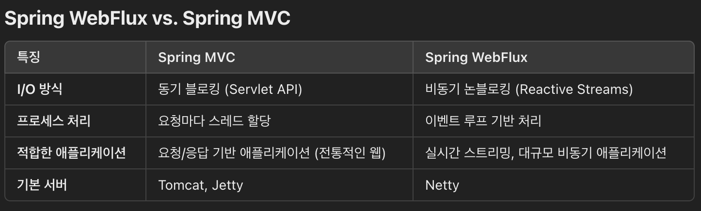

# 비동기 타임 아웃 설정

    setDefaultTimeout() 
    해당 함수를 이용하면 비동기 실행의 기본 타임 아웃을 설정할 수 있습니다.

# 타임 아웃 예외 핸들링
    타임 아웃 예외가 발생하면 "AsyncRequestTimeoutException.class" 호출됩니다.
    @ControllerAdive 를 사용해서 사용자가 예외를 핸들링 할 수 있습니다.

# 비동기 반환 클래스/인터페이스

    # Callable<T> 인터페이스
        특별한 설정 없이 비동기를 구현할 수 있다.

    # DeferedResult<T> 클래스
        비동기 처리에 대한 결과 값을 받을 수 있다.
        결과를 원하는 시점에 클라이언트에게 반환할 수 있습니다.
        타임 아웃, 예외 상황에 대한 세부 제어가 가능합니다.

    # CompletableFuture<T> 클래스
        다양한 콜백 함수를 지원합니다.
        결과를 조합하고 변환하는 유연한 API 제공.
        스레드 풀을 효율적으로 사용하여 성능 향상.

    "DefferedResult 클래스"는 결과 값을 받을 수는 있지만 어느 시점에 결과 값이 도착하는지 알 수 없다.
    하지만 "CompletableFuture 클래스"는 콜백 함수를 지원하기 때문에 결과 도착 시점을 정확히 알 수 있다.

    즉 다시 말해 "DefferedResult 클래스"는 결과 값을 단순히 기록한다.
    만약 결과 값을 받은 후 후행 작업이 추가적으로 있다면 "CompletableFuture 클래스"를 사용한다.

# 비동기 관련 추가 사항

    # Executor 인터페이스
        쓰레드를 미리 만들어두고 재사용하기 위한 쓰레드 풀(Thread Pool)

    # ExecutorService 인터페이스
        ExecutorService는 Executor를 상속받아서 작업 등록 뿐만 아니라 실행을 위한 책임도 갖습니다.

    # 추가 정보
    https://velog.io/@ssssujini99/Java-Callable-Executors-ExecutorService-%EC%9D%98-%EC%9D%B4%ED%95%B4-%EB%B0%8F-%EC%82%AC%EC%9A%A9%EB%B2%95

# ResponseBodyEmitter

    서버가 클라이언트에게 비동기적으로 응답 데이터를 전송할 수 있도록 지원하는 클래스입니다. 
    이 클래스는 서버에서 데이터 생성이 완료되지 않은 상태에서 클라이언트로 데이터를 점진적으로 스트리밍해야 하는 경우 유용합니다.

    참고로 우리가 사용하는 기본 HTTP는 실시간으로 데이터를 받어서 처리가는 것이 아니라
    서버에서 처리가 완료된 후 결과를 한번에 받는다.

    하여 "ResponseBodyEmitter" 와 같은 실시간 데이터를 확인하기 위해서는
    실시간 데이터를 처리할 수 있는 JavaScript 의 "Fetch API" 로 서버에서 데이터를 실시간 스트리밍 받을 수 있다.

# 비동기 인터셉터

    기존 인터셉터와 다른점은 있다면 
    비동기 인터셉터는 "AsyncHandlerInterceptor" 를 구현한다는 것 이다.

# 웹소켓(STOMP, Simple Text Oriented Protocol)

    서버/클라이언트가 서로 양방향 통신을 할 수 있다.

    <dependency>
        <groupId>org.springframework.boot</groupId>
        <artifactId>spring-boot-starter-websocket</artifactId>
    </dependency>

    1. 웹소켓 설정
        WebSocketConfig.java 파일을 참고하세요.

    2. Controller 구현
        WebSocketController.java 파일을 참고하세요.
        @MessageMapping 설정 어노테이션
        @SendTo 응답 어노테이션

    3. WebSocket.jsp
        웹소켓 호출
        http://localhost:8080/websocket

# Spring WebFlux

    준비중...
        
    

    
